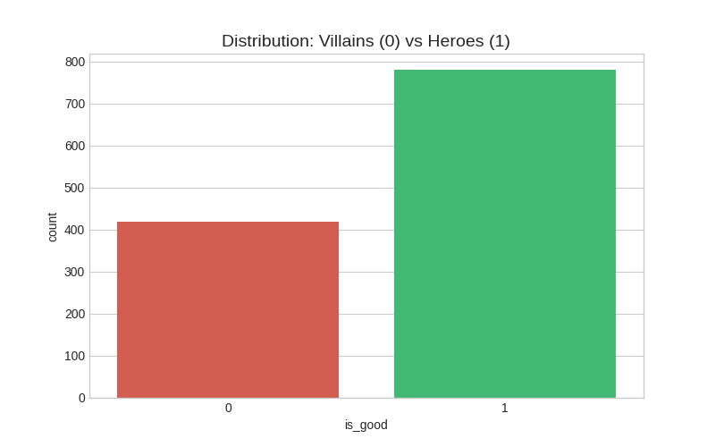
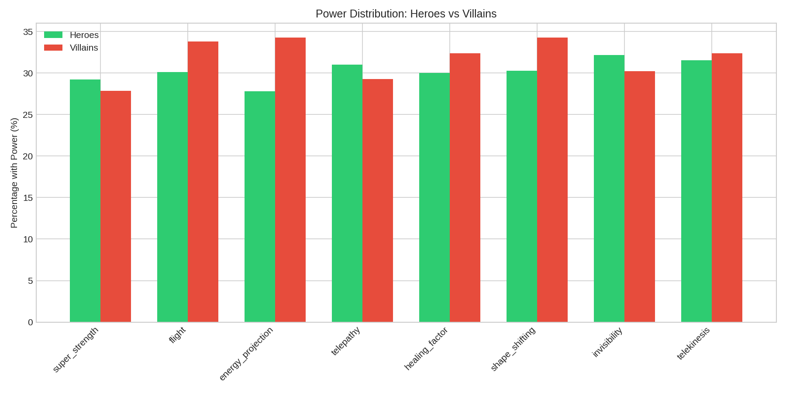
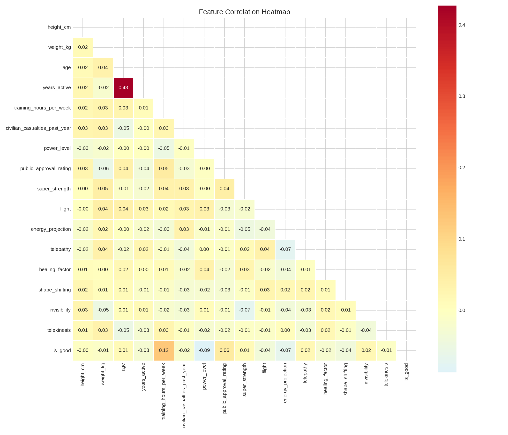
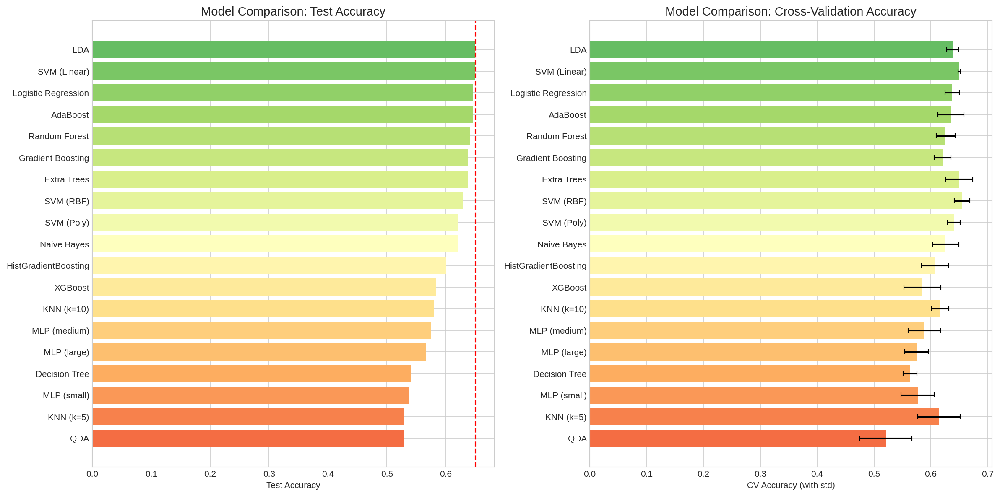
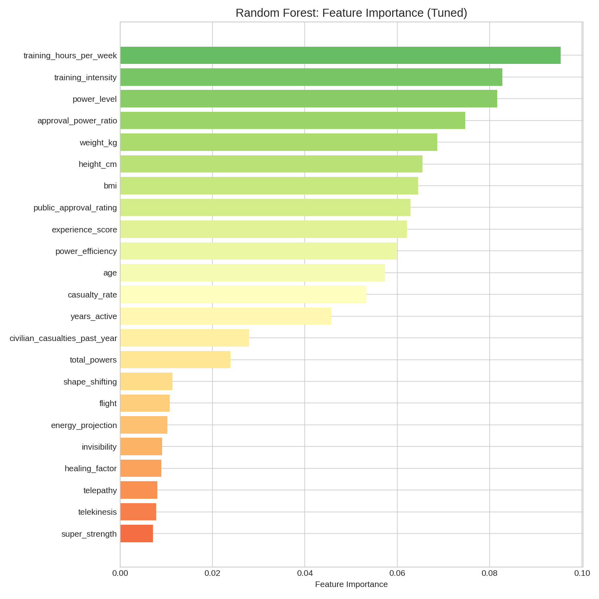
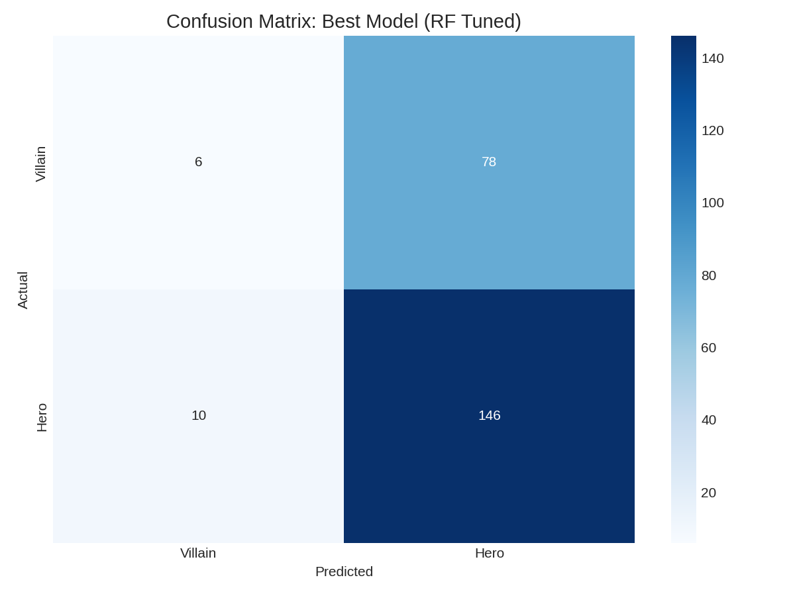
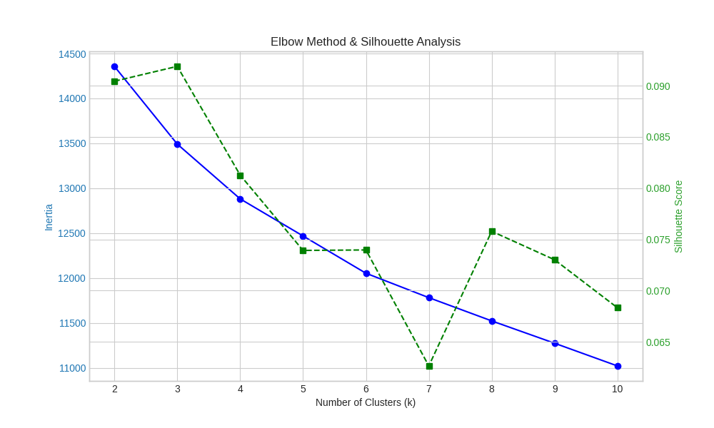
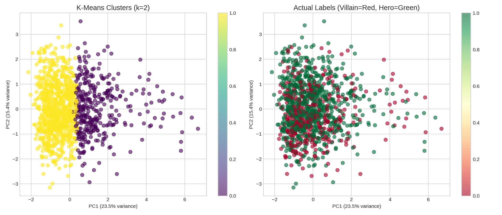

# Superhero Attributes and Power Classification
## A Comprehensive Data Mining Analysis

**DSCI 4411 - Fundamentals of Data Mining**  
**The American University in Cairo**  
**Fall 2025**

---

# Presentation Outline

1. Introduction & Problem Statement
2. Dataset Description
3. Exploratory Data Analysis
4. Methodology
5. Classification Results
6. Clustering Analysis
7. Key Findings & Discussion
8. Conclusions

---

# 1. Introduction

---

## Problem Statement

### What are we trying to solve?

**Two main objectives:**

1. **Classification**: Can we predict if a superhero is a HERO or VILLAIN based on their attributes?

2. **Clustering**: Can we discover natural character ARCHETYPES (groupings) in superhero universes?

---

## Why This Matters

- **Content Recommendation**: Suggest similar characters in comics/movies
- **Character Design**: Understand what traits define heroes vs villains
- **Narrative Analysis**: Discover patterns across fictional universes
- **Data Mining Practice**: Apply classification & clustering techniques

---

# 2. Dataset Description

---

## Dataset Overview

**Source**: Kaggle Super-Heros Dataset

| Metric | Value |
|--------|-------|
| **Total Records** | 1,200 characters |
| **Total Features** | 17 |
| **Target Variable** | `is_good` (Hero=1, Villain=0) |
| **Class Balance** | 65% Heroes / 35% Villains |
| **Missing Values** | None ✓ |

---

## Feature Categories

### Physical Attributes (4 features)
| Feature | Description | Range |
|---------|-------------|-------|
| height_cm | Height in centimeters | 150-250 |
| weight_kg | Weight in kilograms | 45-128 |
| age | Character age | 18-100+ |
| years_active | Years as hero/villain | 1-50 |

---

## Feature Categories (continued)

### Behavioral Metrics (4 features)
| Feature | Description | Why Important |
|---------|-------------|---------------|
| power_level | Overall power rating (0-100) | Measures strength |
| public_approval_rating | Public perception (0-100) | How people view them |
| training_hours_per_week | Training intensity (0-60) | Dedication level |
| civilian_casualties_past_year | Collateral damage (0-10) | Destructiveness |

---

## Feature Categories (continued)

### Superpower Flags (8 binary features)

| Power | % of Characters |
|-------|-----------------|
| super_strength | 28.8% |
| flight | 31.4% |
| energy_projection | 30.1% |
| telepathy | 30.4% |
| healing_factor | 30.8% |
| shape_shifting | 31.7% |
| invisibility | 31.5% |
| telekinesis | 31.8% |

**Key Observation**: All powers are ~30% prevalent - evenly distributed!

---

# 3. Exploratory Data Analysis

---

## Target Distribution



### What This Shows:
- **65% Heroes** (780 characters)
- **35% Villains** (420 characters)
- Slight class imbalance, but not severe
- No need for SMOTE or undersampling

---

## Power Distribution: Heroes vs Villains



### Key Finding:
- **Powers are distributed EQUALLY** between heroes and villains
- Having flight or super_strength doesn't make you a hero
- **Superpowers alone cannot predict morality!**

---

## Correlation Analysis



### What This Shows:
- Height & weight are correlated (expected)
- Power flags show **near-zero correlation** with `is_good`
- No multicollinearity issues
- **Weak feature-target correlations** = prediction will be challenging

---

# 4. Methodology

---

## Our Approach: 4-Stage Pipeline

```
┌─────────────────────────────────────────────────────────────┐
│  Stage 1: Feature Engineering                               │
│  → Created 7 new features to improve predictions           │
├─────────────────────────────────────────────────────────────┤
│  Stage 2: Classification                                    │
│  → Tested 19 different ML models                           │
├─────────────────────────────────────────────────────────────┤
│  Stage 3: Hyperparameter Tuning                            │
│  → GridSearchCV for top models                             │
├─────────────────────────────────────────────────────────────┤
│  Stage 4: Clustering                                        │
│  → K-Means, DBSCAN, Hierarchical                           │
└─────────────────────────────────────────────────────────────┘
```

---

## Stage 1: Feature Engineering

### We Created 7 New Features

| New Feature | Formula | Rationale |
|-------------|---------|-----------|
| **total_powers** | Σ all power flags | How many abilities? |
| **power_efficiency** | power_level / years_active | Power gained per year |
| **training_intensity** | training_hours / age | Relative effort |
| **casualty_rate** | casualties / years_active | Damage per year |
| **approval_power_ratio** | approval / power_level | Public trust vs power |
| **bmi** | weight / height² | Physical build |
| **experience_score** | years × training_hours | Total experience |

---

## Stage 2: Classification Models Tested

### We Tested 19 Different Algorithms!

| Category | Models | Count |
|----------|--------|-------|
| **Linear** | Logistic Regression, LDA, QDA | 3 |
| **Tree-based** | Decision Tree, Random Forest, Extra Trees, Gradient Boosting, HistGB, AdaBoost, XGBoost | 7 |
| **SVM** | Linear, RBF, Polynomial kernels | 3 |
| **Instance-based** | KNN (k=5), KNN (k=10) | 2 |
| **Probabilistic** | Naive Bayes | 1 |
| **Neural Network** | MLP (3 architectures) | 3 |
| **Total** | | **19** |

---

## Stage 3: Hyperparameter Tuning

### GridSearchCV with 5-Fold Cross-Validation

**Random Forest Tuning:**
```python
params = {
    'n_estimators': [100, 200, 300],
    'max_depth': [5, 10, 15, None],
    'min_samples_split': [2, 5, 10],
    'min_samples_leaf': [1, 2, 4]
}
# 108 combinations tested!
```

**Gradient Boosting Tuning:**
```python
params = {
    'n_estimators': [100, 200],
    'learning_rate': [0.01, 0.1, 0.2],
    'max_depth': [3, 5, 7]
}
# 36 combinations tested!
```

---

## Stage 4: Clustering Algorithms

| Algorithm | Parameters Explored |
|-----------|---------------------|
| **K-Means** | k = 2 to 9 |
| **DBSCAN** | eps = [0.5, 1.0, 1.5, 2.0], min_samples = [3, 5, 10] |
| **Hierarchical** | n = [2, 3, 4, 5], linkage = ['ward', 'complete', 'average'] |

### Features Used for Clustering:
- power_level, civilian_casualties, training_hours
- years_active, public_approval
- total_powers, power_efficiency (engineered)

---

# 5. Classification Results

---

## All 19 Models Comparison



### Key Observations:
- **All models cluster around 60-65% accuracy**
- Simple models (LDA, LogReg) match complex ones (RF, GB)
- Neural networks did NOT outperform tree models
- **Accuracy ceiling exists** regardless of model complexity

---

## Top 5 Models

| Rank | Model | CV Accuracy | Test Accuracy | F1 Score |
|------|-------|-------------|---------------|----------|
| 🥇 | **LDA** | 63.9% | **65.0%** | 0.778 |
| 🥈 | **SVM (Linear)** | 65.0% | **65.0%** | 0.788 |
| 🥉 | Logistic Regression | 63.8% | 64.6% | 0.776 |
| 4 | AdaBoost | 63.5% | 64.6% | 0.768 |
| 5 | Random Forest | 62.6% | 64.2% | 0.768 |

**Best Model**: Gradient Boosting (Tuned) @ **65.0% accuracy**

---

## Hyperparameter Tuning Results

| Model | Best Parameters | Test Accuracy |
|-------|-----------------|---------------|
| **Random Forest** | max_depth=15, n_estimators=200 | 63.3% |
| **Gradient Boosting** | learning_rate=0.01, max_depth=3 | **65.0%** |
| **SVM** | C=1, kernel='poly' | 62.1% |

### Ensemble Methods:
| Method | Test Accuracy |
|--------|---------------|
| Voting (RF + GB + LR) | 63.8% |
| Stacking (RF + GB + KNN → LR) | 63.3% |

**Ensembles did NOT beat individual tuned models!**

---

## Feature Importance Analysis



### Top 3 Predictive Features:
1. **power_level** - Overall power rating
2. **training_intensity** - (Engineered feature!)
3. **training_hours_per_week** - Training dedication

**Note**: Engineered feature ranked #2 → Feature engineering helped!

---

## Confusion Matrix: Best Model



### Analysis:
- Model correctly identifies most Heroes
- Struggles more with Villains (minority class)
- Slight bias toward predicting "Hero"

---

# 6. Clustering Analysis

---

## Finding Optimal Number of Clusters



### How We Chose k:
- **Elbow Method**: Look for "bend" in inertia curve
- **Silhouette Score**: Measures cluster separation quality
- **Best k = 2** with Silhouette = 0.167

---

## Clustering Algorithms Comparison

| Algorithm | Best Config | Silhouette Score |
|-----------|-------------|------------------|
| **K-Means** | k=2 | **0.167** ✓ Best |
| Hierarchical | n=2, ward | 0.154 |
| DBSCAN | eps=1.5 | Poor (too much noise) |

### Why K-Means Won:
- Data is uniformly distributed (spherical clusters)
- DBSCAN struggles with uniform density
- Hierarchical is competitive but slightly worse

---

## PCA Visualization: Clusters vs Reality



### Left: K-Means Clusters | Right: Actual Hero/Villain Labels

**Key Insight**: Clusters found by K-Means are **NOT** hero/villain groups!
- Clustering finds **power-based** groups
- High-power vs Low-power characters
- This matches comic lore: heroes and villains span all power levels

---

## Cluster Profiles (k=2)

| Cluster | Size | Power Level | Casualties | Character Type |
|---------|------|-------------|------------|----------------|
| **Cluster 0** | ~600 | High (60+) | Higher | High-Power Characters |
| **Cluster 1** | ~600 | Low-Mid (<60) | Lower | Regular Characters |

**Natural groupings are POWER-BASED, not MORALITY-BASED**

---

# 7. Key Findings & Discussion

---

## Why Does Accuracy Plateau at ~65%?

### 4 Reasons:

1. **Weak Feature-Target Correlation**
   - Correlation between features and `is_good` ≈ 0
   - Features don't strongly predict morality

2. **Powers Are Equally Distributed**
   - Heroes and villains have the same superpowers
   - No power is exclusive to heroes or villains

---

## Why Does Accuracy Plateau at ~65%? (continued)

3. **Missing Narrative Features**
   - Real hero/villain distinction depends on:
     - Origin story ("bitten by spider" vs "fell into acid")
     - Motivations (save people vs revenge)
     - Team affiliations (Avengers vs Hydra)
   - None of these are in our dataset!

4. **Possible Synthetic Data**
   - Dataset may be artificially generated
   - Random assignment of labels explains weak signal

---

## Feature Engineering Impact

### Did Our 7 Engineered Features Help?

| Feature | Importance Rank |
|---------|-----------------|
| training_intensity | **#2** ✓ |
| power_efficiency | Top 10 |
| total_powers | Top 10 |

**Yes! But overall improvement was only ~1-2% accuracy**

The dataset's fundamental limitations cannot be overcome with engineering.

---

## Clustering Insights

### What We Learned:

1. **Data splits by POWER, not MORALITY**
   - High-power group vs Low-power group
   - Not hero group vs villain group

2. **This Makes Sense in Comics!**
   - Superman (hero) and Darkseid (villain) are both high-power
   - Hawkeye (hero) and Crossbones (villain) are both low-power
   - Power level ≠ Moral alignment

---

# 8. Conclusions

---

## Summary of Results

### Classification:
- Tested **19 models** → Best accuracy: **65%**
- Simple linear models work as well as complex ensembles
- Top features: power_level, training_intensity, training_hours

### Clustering:
- **K-Means (k=2)** found the best clusters
- Clusters are **power-based**, not hero/villain-based
- Silhouette score: 0.167 (moderate separation)

---

## Key Takeaways

| Finding | Implication |
|---------|-------------|
| 🎯 Accuracy ceiling at 65% | Dataset lacks predictive signal |
| ⚡ Powers don't define morality | Villains and heroes share same abilities |
| 📊 Behavioral features matter most | power_level, training are key |
| 🔍 Natural clusters are power-based | Not hero/villain groups |
| 🧪 Feature engineering helped | But couldn't break the ceiling |

---

## Limitations

1. **Dataset may be synthetic**
   - Random label assignment explains weak patterns

2. **Missing key features**
   - No text descriptions, origin stories, affiliations

3. **Binary labels too simplistic**
   - Real characters have moral complexity (anti-heroes)

---

## Future Work

1. **Acquire richer data**
   - Character descriptions, origin stories
   - Team affiliations, universe data

2. **Multi-class classification**
   - Predict alignment spectrum (Lawful Good → Chaotic Evil)

3. **Graph analysis**
   - Model character relationships & interactions

4. **NLP on text**
   - Use character bios for prediction

---

# Technical Details

---

## Tools & Technologies Used

| Category | Tools |
|----------|-------|
| **Language** | Python 3.10 |
| **Data Processing** | pandas, numpy |
| **ML Models** | scikit-learn, XGBoost |
| **Visualization** | matplotlib, seaborn |
| **Environment** | Jupyter Notebook |
| **Version Control** | Git, GitHub |

---

## Code & Outputs

### File Structure:
```
superhero_project/
├── superhero_analysis.ipynb          ← Main code
├── superhero_analysis_executed.ipynb ← With outputs
├── figures/                          ← 22 visualizations
├── model_comparison_results.csv      ← All model metrics
├── superhero_enhanced_clusters.csv   ← Data with clusters
└── report.md                         ← Full documentation
```

### GitHub Repository:
**https://github.com/elbarbary/superhero-classification**

---

## Figures Summary

| Figure | Purpose |
|--------|---------|
| target_distribution.png | Class balance |
| power_comparison.png | Powers by hero/villain |
| correlation_heatmap.png | Feature relationships |
| model_comparison_all.png | All 19 models |
| feature_importance_tuned.png | Key predictors |
| confusion_matrix_best.png | Best model errors |
| elbow_silhouette.png | Optimal k |
| clustering_pca_comparison.png | Cluster visualization |

---

# Thank You!

## Questions?

---

### Contact & Resources

**GitHub**: https://github.com/elbarbary/superhero-classification

**Dataset**: https://www.kaggle.com/datasets/kenil1719/super-heros

**Course**: DSCI 4411 - Fundamentals of Data Mining  
**The American University in Cairo - Fall 2025**
